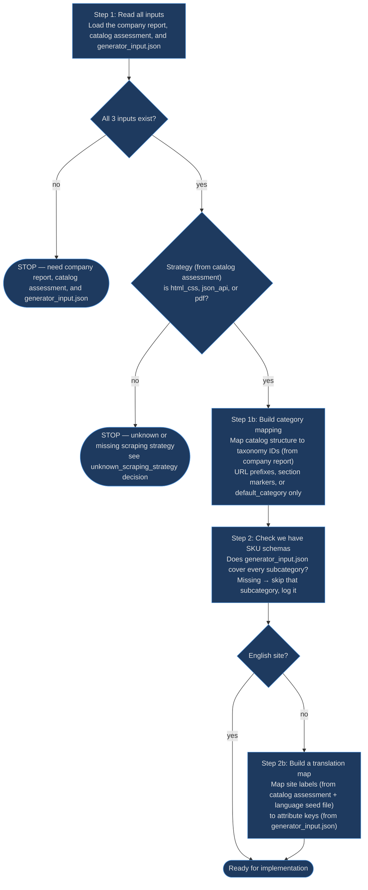
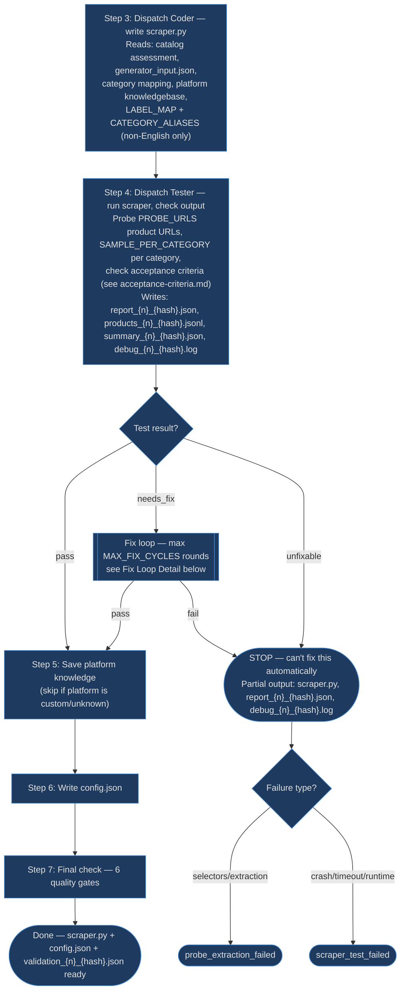
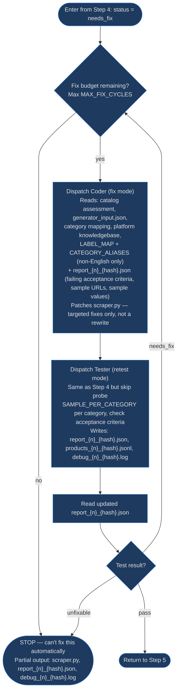

# Scraper Generator Workflow

## Context

This workflow takes what we know about a company's catalog and turns it into a working Python scraper that extracts product data.

Three agents collaborate, each with a single job:

| Agent | What it does | What it never does |
|-------|-------------|-------------------|
| **Orchestrator** (this document) | Loads context, makes decisions, manages retries, escalates problems | Write code, run the scraper |
| **Coder** (`references/coder.md`) | Writes `scraper.py` from scratch or patches it when tests fail | Run the scraper, decide what to fix |
| **Tester** (`references/tester.md`) | Runs the scraper, checks the output against acceptance criteria, writes `report_{n}_{hash}.json` | Write or modify code |

The final scraper is a single standalone `.py` file with no imports from this codebase — it runs independently in production.

### Inputs

These files must exist before the orchestrator starts. SKILL.md is responsible for providing them.

| File | Source | Used in | What the orchestrator reads from it |
|------|--------|---------|-------------------------------------|
| Company report | `/product-classifier` | Step 1, 1b | Site URL, taxonomy IDs, business model |
| Catalog assessment | `/catalog-detector` | Step 1, 1b | Scraping strategy, URL prefixes, selectors, platform, product count |
| `generator_input.json` | Prep script (`orchestrator_prepare_generator_input.py`) | Step 1, 2 | Routing tables: core/extended attribute keys, types, units per subcategory |
| Product taxonomy (`categories.md`) | `/product-taxonomy` | Step 2 | Valid subcategory IDs (to verify schemas exist) |
| Language seed (`labels-{lang}.json`) | Platform knowledgebase | Step 2b | Common label→English translations (non-English sites only, may not exist) |

### Outputs

| File | Written in | Description |
|------|-----------|-------------|
| `scraper.py` | Step 3 | Standalone scraper script |
| `config.json` | Step 6 | Config metadata |
| `output/report_{n}_{hash}.json` | Step 4 | Test report. Never overwritten. |
| `output/products_{n}_{hash}.jsonl` | Step 4 | Product data. Never overwritten. |
| `output/debug_{n}_{hash}.log` | Step 4 | Debug log. Never overwritten. |
| `output/summary_{n}_{hash}.json` | Step 4 | Run summary — `total_products`, `duration_seconds`, `errors_count`. |
| `output/validation_{n}_{hash}.json` | Step 7 | Validation diagnostics. Never overwritten. |
| Language seed (`labels-{lang}.json`) | After each Coder dispatch | Updated with new translations after every fix cycle (non-English only) |
| Platform knowledgebase | Step 5 | Updated with platform-specific patterns (enumerated platforms only) |

**Output path ownership:** The orchestrator computes all versioned output paths (`products_{n}_{hash}.jsonl`, `summary_{n}_{hash}.json`, `debug_{n}_{hash}.log`) and passes them to the tester. The tester passes them to the scraper as CLI arguments. The scraper writes directly to those paths — no renaming after the fact. The tester computes its own `report_{n}_{hash}.json` path. The orchestrator computes `validation_{n}_{hash}.json` and writes it directly.

### Constants

Single source of truth for all tunable limits. Diagrams and prose reference this table.

| Name | Value | Description |
|------|-------|-------------|
| `MAX_FIX_CYCLES` | 5 | Max Coder fix → Tester retest rounds before giving up |
| `MAX_FIX_ATTEMPTS_PER_RULE` | 2 | Max targeted fix attempts for the same rule ID before escalating |
| `RETEST_TIMEOUT` | 5 min | Timeout for a single retest tester dispatch |
| `PROBE_URLS` | 1 per category, min 3 | Product URLs probed during Step 4 — quick sanity check before full sample |
| `SAMPLE_PER_CATEGORY` | 20% of category size, min 5, max 25 | Products sampled per category — used in Step 4 and all retests |

### Preparation (Steps 1–2b)



### Implementation (Coder → Tester → Finalize)



### Fix Loop Detail



---

## Step 1: Load Context

Read the company report and extract: site URL, subcategory taxonomy IDs, business model.

Read the catalog assessment and extract: scraping strategy (`html_css`, `json_api`, `pdf`), platform, estimated product count, anti-bot severity, and currency from the header metadata. Read the `## Extraction Blueprint` section for the data source (API endpoints, selectors), product discovery (pagination, verified category tree), product data extraction (price, name, SKU, spec table, breadcrumb selectors with verified examples), and platform-specific notes.

If no catalog assessment exists, escalate — see the `missing_catalog_assessment` decision.

Validate the scraping strategy is one of: `html_css`, `json_api`, `pdf`. If the strategy is missing or not one of these three values, escalate — see the `unknown_scraping_strategy` decision.

Read the pre-processed generator input file (`generator_input.json`). This JSON contains subcategory schemas (`core_attribute_keys`/`extended_attribute_keys` lists, `attribute_types` dict, and `units` dict per subcategory) built from the SKU schemas by `orchestrator_prepare_generator_input.py`. Use these tables directly in the coder dispatch (Step 3) — do not re-read raw SKU schema files.

The routing tables in `generator_input.json` determine attribute placement in the scraper output:

- Matched **core** key → `core_attributes`
- Matched **extended** key → `extended_attributes`
- No match → `extra_attributes`

Use **EXACT key values** from the schema's Key column. For multi-subcategory companies, each subcategory has a separate routing table — the same attribute may be core in one schema and extended in another.

**`extra_attributes` governance:** `snake_case` keys; primitive values (`string`, `number`, `boolean`) or arrays of primitives; no nested objects.

---

## Step 1b: Build Category Mapping

Build a mapping so the scraper classifies products into taxonomy IDs at runtime without any LLM. Set `default_category` to the company's primary taxonomy ID (fallback when no other rule matches).

For **single-subcategory companies**, the mapping is trivial — `category_mapping` can be empty and all products use `default_category`.

For **multi-subcategory companies**, the mapping depends on how the catalog is structured:

### URL-based navigation (`html_css`, `json_api` with category URLs)

Map each URL prefix from the catalog assessment to a taxonomy ID. If a prefix cannot be matched to any subcategory in the company report, escalate — see the `unmapped_url_prefix` decision.

```json
{
  "category_mapping": {
    "/Head-Protection/": "safety.head_protection",
    "/Respiratory-Protection/": "safety.respiratory_protection"
  },
  "default_category": "safety.respiratory_protection"
}
```

### In-document structure (`pdf`, or `html_css` with all products on one page)

No URL navigation — the category comes from within the document. The catalog assessment's extraction blueprint identifies the structural markers (PDF section headings, HTML grouping headers, table sections, or a category column). The mapping keys reference these markers:

```json
{
  "category_mapping": {
    "section:Head Protection": "safety.head_protection",
    "section:Respiratory": "safety.respiratory_protection"
  },
  "default_category": "safety.respiratory_protection"
}
```

For flat sources with no category structure (single table, no section headings), use an empty `category_mapping` — all products get `default_category`.

Store the mapping in config (see Step 6).

---

## Step 2: Verify SKU Schemas

Check `generator_input.json` for each subcategory taxonomy ID from the company report. Each subcategory must have an entry in the `subcategory_schemas` dict. For single-subcategory companies, one entry. For multi-subcategory companies, one entry per subcategory — the scraper uses the Step 1b category mapping to determine which schema applies per product.

If a subcategory key is missing from `subcategory_schemas`, **skip it** — remove it from the category mapping, log the skipped subcategory, and continue with what's available. The skipped subcategories are reported in the final output (see `validation_{n}_{hash}.json` field `skipped_subcategories`). The SKILL.md wrapper handles the `no_sku_schema` decision before the orchestrator starts.

---

## Step 2b: Build Label Map (non-English only)

Skip for English-language sites.

Build the `LABEL_MAP` and `CATEGORY_ALIASES` dicts that the scraper will use to translate source-language attribute labels to English schema keys.

**Sources (in priority order):**
1. **Language seed file** — check the platform knowledgebase for a language seed (e.g., `labels-lv.json` for Latvian). Load common translations as the starting point.
2. **Extraction blueprint sample labels** — the catalog assessment's `## Extraction Blueprint > ### Product Data Extraction > #### Sample Attribute Labels` table contains sample attribute labels from 3-5 product pages. Map each label to a schema key using the attribute routing tables from `generator_input.json` (described in Step 1).
3. **Unmapped labels** — labels that don't match any schema key must still be translated to English, then stored in `extra_attributes` with `snake_case` English keys. For example, Latvian label "Garums" → English "length" → key `length`. Include these translations in `LABEL_MAP` so the scraper produces English keys, not source-language keys.

**Build CATEGORY_ALIASES** for labels that map to different schema keys per subcategory (e.g., "thickness" → `nominal_thickness` for lumber, `thickness` for flooring). The language seed may already contain aliases — use those, add new ones from blueprint labels.

**No coverage gate** — build the best translation map possible and continue. If attributes end up empty because of poor translations, the Tester will catch it via the acceptance criteria.

**After successful scraper generation:** Save the merged LABEL_MAP back to the language seed file to enrich it for future sites.

---

## Step 3: Dispatch Coder

Dispatch the coder sub-agent to write the initial `scraper.py`. The coder reads `references/coder.md` for the complete product record format, library selection, required behavior, product discovery strategy, CLI flags, persist hooks, and Python code quality rules.

### Input to coder

Full contract in `references/coder.md` Input Contract.

| Field | Description |
|---|---|
| `mode` | `"generate"` or `"fix"` |
| `catalog_assessment` | Full catalog assessment document |
| `routing_tables_path` | Path to `generator_input.json` (attribute routing tables per subcategory) |
| `category_mapping` | Category mapping from Step 1b (URL prefixes, section markers, or empty) |
| `platform_knowledgebase` | Platform-specific patterns (if platform is an enumerated value) |
| `scraper_output_path` | Path where the coder writes `scraper.py` |
| `LABEL_MAP` + `CATEGORY_ALIASES` | (non-English only) Translation maps from Step 2b |
| `report_path` | (fix mode only) Path to the previous tester's `report_{n}_{hash}.json` — failing acceptance criteria, sample URLs, sample values |
| `existing_scraper_path` | (fix mode only) Path to the current `scraper.py` to patch |

### Output from coder

| File | Description |
|------|-------------|
| `scraper.py` | Standalone scraper script written to `scraper_output_path`. No structured return — the file on disk is the output. |

---

## Step 4: Dispatch Tester

Dispatch the tester sub-agent to run the scraper and evaluate its output. The tester reads `references/tester.md` for acceptance criteria, run strategies, and report format.

The tester probes `PROBE_URLS` product URLs, samples `SAMPLE_PER_CATEGORY` products per category, and checks the acceptance criteria.

### Input to tester

| Field | Description |
|---|---|
| `mode` | `"test"` or `"retest"` |
| `scraper_path` | Path to `scraper.py` |
| `catalog_structure` | Categories, navigation paths, top-level category list from catalog assessment |
| `expected_product_count` | From the catalog assessment |
| `routing_tables_path` | Path to `generator_input.json` (for schema-aware acceptance criteria checks) |
| `iteration` | Iteration number (1 for first test run, increments for each retest) |
| `output_paths` | Versioned paths computed by the orchestrator: `products_{n}_{hash}.jsonl`, `summary_{n}_{hash}.json`, `debug_{n}_{hash}.log`. The tester passes these to the scraper as `--output-file`, `--summary-file`, `--log-file` CLI arguments. |
| `report_path` | Path for `report_{n}_{hash}.json` (computed by the tester) |
| `probe_urls` | List of product URLs for probing — 1 per category, min 3 (from `PROBE_URLS` constant) |
| `sample_per_category` | Max products per category — 20% of category size, min 5, max 25 (from `SAMPLE_PER_CATEGORY` constant) |
| `fix_targets` | (retest only) Acceptance criteria IDs that the coder fixed — tester focuses verification on these |
| `regression_sample_from` | (retest only) Categories that were passing before the fix — tester checks for regressions |

### Output from tester

| File |
|------|
| `report_{n}_{hash}.json` |
| `products_{n}_{hash}.jsonl` |
| `summary_{n}_{hash}.json` |
| `debug_{n}_{hash}.log` |

Full format is defined in `references/tester.md`. The orchestrator reads these fields from the latest `report_{n}_{hash}.json`:

- **`status`** — `"pass"`, `"needs_fix"`, `"unfixable"`, or `"script_error"` — drives the fix→retest state machine. `"script_error"` means a tester helper script crashed (not the scraper's fault) — escalate to the user immediately, do not enter fix loop.
- **`rule_results`** — per acceptance criterion pass/fail with values — used for fix attempt tracking
- **`issues`** — acceptance criteria IDs, affected categories, sample URLs/values — passed to coder as fix targets
- **`passing_categories`** — passed to tester as `regression_sample_from` in retest mode

Retest mode adds: `fix_results`, `regression_results`, `new_issues` (schemas in `references/tester.md`).

---

## Fix→Retest Loop

The orchestrator manages a state machine that iterates between the coder and tester until the scraper passes or budget is exhausted. See the **Fix Loop Detail** diagram above for the visual flow.

### "unfixable" status — context-dependent behavior

The tester returns `"unfixable"` when the crash or no-output acceptance criteria fail (see `references/acceptance-criteria.md` for actual rule IDs). The orchestrator's response depends on the context:

| Context | Tester returns "unfixable" | Orchestrator action |
|---------|---------------------------|---------------------|
| **Test mode** (first run) | Scraper fundamentally broken | ESCALATE immediately. No fix loop — a crash or empty output on the first run means the extraction approach is wrong. |
| **Retest mode** (after a fix) | Fix introduced a crash or broke output | ESCALATE immediately. A coder patch that causes a crash is not recoverable by another patch — escalate with the debug log showing what broke. |

In both cases, the orchestrator does NOT retry. "Unfixable" always means immediate escalation. The distinction is which escalation decision to use: if the crash is related to extraction (selectors, parsing) → `probe_extraction_failed`; if it's a runtime issue (timeout, memory, HTTP) → `scraper_test_failed`.

### "needs_fix" exhaustion — attribute coverage

When the fix→retest loop exhausts `MAX_FIX_CYCLES` and the remaining failures are the attribute coverage acceptance criteria, the orchestrator escalates as `not_enough_attributes_to_extract`. This is distinct from extraction failures (selectors, parsing) — it means the catalog genuinely doesn't expose enough attributes for the schema. The coder should report any important catalog attributes that couldn't be mapped to schema keys (schema gap report).

### Coder fix dispatch input

Same fields as the Step 3 input table with `mode` set to `"fix"` — including `report_path` and `existing_scraper_path` (marked "fix mode only" in that table). The coder receives the full context on every dispatch — it always has the complete picture.

### Circuit breakers

| Breaker | Limit |
|---|---|
| Fix → retest cycles | `MAX_FIX_CYCLES` |
| Same acceptance criterion failing after fix | `MAX_FIX_ATTEMPTS_PER_RULE` |
| Retest timeout | `RETEST_TIMEOUT` |

**Per-criterion tracking:** The orchestrator maintains a dict `rule_fix_attempts: {rule_id: int}` counting how many times each acceptance criterion has been explicitly listed in `fix_targets` for a coder dispatch. Only explicit targets increment the counter — a criterion that fails as collateral damage from a fix aimed at a different one does NOT count.

**Worked example** (uses real acceptance criteria IDs — see `references/acceptance-criteria.md` for the full list and thresholds):

| Cycle | fix_targets sent | Tester result | rule_fix_attempts after |
|-------|-----------------|---------------|------------------------|
| 1 | `[S01, M01]` | S01 pass, M01 fail | `{S01: 1, M01: 1}` |
| 2 | `[M01]` | M01 fail, S03 fail (collateral) | `{S01: 1, M01: 2, S03: 0}` |
| 3 | `[S03]` | S03 fail | `{S01: 1, M01: 2, S03: 1}` |

At this point M01 is exhausted (`MAX_FIX_ATTEMPTS_PER_RULE` attempts) but still failing → ESCALATE. S03 only has 1 attempt but the overall budget (`MAX_FIX_CYCLES`) is also exhausted. Note: M01 failing in cycle 2 counts as attempt 2 because it was in `fix_targets`. S03 failing in cycle 2 does NOT count because it was collateral — it only gets counted when explicitly targeted in cycle 3.

---

## Label Handling (non-English sites)

For non-English sites, the orchestrator builds the best LABEL_MAP it can in Step 2b (one pass) and moves on. There is no separate label extension retry loop — if missing translations cause low attribute coverage, the fix loop (`MAX_FIX_CYCLES`) handles it. The Coder can improve the LABEL_MAP as part of a targeted fix when the core attribute coverage criterion fails due to unmapped labels.

---

## Diagnostic Persistence

All output files use `{name}_{n}_{hash}.{ext}` versioning — `n` is iteration, `hash` is content hash. Never overwritten. No unversioned copies.

The orchestrator reads the latest file by sorting on `n` (highest iteration wins).

### validation_{n}_{hash}.json

Written by the orchestrator after successful validation (tester returns "pass").

**Contents:** `status`, `rule_results`, `issues` (from the latest `report_{n}_{hash}.json`), plus orchestrator state: `probe_results`, `label_coverage_at_probe` (float for non-English, null for English), `fix_cycles_used` (int), `generated_at` (ISO 8601).

---

## Step 5: Write Back to Platform Knowledgebase

After successful validation, write discoveries back to the platform knowledgebase. Skip for `unknown` or `custom` platforms — only run for enumerated values (`woocommerce`, `shopify`, `magento`, `prestashop`, `opencart`, `bigcommerce`, `squarespace`, `wix`, `drupal`). Create if it doesn't exist; append without removing existing content.

Write to: **JSON-LD Patterns**, **CSS Selectors**, **Pagination**, **Common Pitfalls**, **Sites Using This Platform** (company name, slug, date, any unusual notes).

---

## Step 6: Prepare Config Metadata

Produce config metadata for the scraper. Example structure (values are illustrative):

```json
{
  "company_slug": "{slug}",
  "category": "{taxonomy_id}",
  "sku_schema": "{category-slug}",
  "scraping_strategy": "html_css",
  "expected_product_count": 1200,
  "subcategories": ["safety.head_protection", "safety.respiratory_protection"],
  "category_mapping": {
    "/Head-Protection/": "safety.head_protection",
    "/Respiratory-Protection/": "safety.respiratory_protection"
  },
  "default_category": "safety.respiratory_protection",
  "generated_at": "2026-03-14T12:00:00Z"
}
```

- `category` — the primary taxonomy ID from the company report
- `sku_schema` — the slug of the SKU schema used (primary subcategory for multi-subcategory companies)
- `scraping_strategy` — the strategy the scraper implements
- `expected_product_count` — from the catalog assessment, updated with actual count if higher
- `subcategories` — list of all taxonomy IDs this scraper covers
- `category_mapping` — URL prefixes or section markers → taxonomy IDs (empty for single-subcategory companies)
- `default_category` — the company's primary taxonomy ID, used as fallback `product_category`
- `generated_at` — ISO 8601 timestamp of when the scraper was generated

### Strict format rules

Product records and config metadata must conform to `references/coder.md` Product Record Format. Key rules verified in Step 7: brand is top-level (never in attribute buckets), product_category is a valid taxonomy ID (not a display name), price is float (not string with `$`), currency is ISO 4217, attribute keys match schema exactly, `category_path` uses ` > ` separator, extra_attributes keys are `snake_case` with primitive values only.

---

## Step 7: Self-Verification

Before presenting results, verify the scraper and config against these quality gates. If any gate fails, fix the issue before proceeding.

| # | Check | Pass criteria |
|---|-------|---------------|
| 1 | **Scraper is standalone** | Single .py file, no imports from the codebase, only allowed libraries |
| 2 | **Tester passed** | Latest `report_{n}_{hash}.json` status is "pass" |
| 3 | **Config metadata complete** | All required fields present with correct values, including `subcategories`, `category_mapping`, and `default_category`. For multi-subcategory companies, every URL prefix from the catalog assessment appears in `category_mapping`. |
| 4 | **Platform knowledgebase updated** | Knowledgebase was written or updated after successful validation (when platform is an enumerated value — not `unknown` or `custom`) |
| 5 | **Multi-subcategory mapping correct** | For multi-subcategory companies: category mapping covers all URL prefixes, scraper uses per-subcategory SKU schemas for attribute routing, and `product_category` varies correctly across products from different sections. |
| 6 | **Label coverage sufficient (non-English sites)** | LABEL_MAP covers ≥70% of discovered attribute labels that map to schema keys. Context-dependent aliases (CATEGORY_ALIASES) exist when the same label maps to different schema keys per subcategory. Skip for English sites. |

If all checks pass, the scraper is complete.

### Output on success

| File |
|------|
| `scraper.py` |
| `config.json` |
| `output/report_{n}_{hash}.json` |
| `output/products_{n}_{hash}.jsonl` |
| `output/debug_{n}_{hash}.log` |
| `output/summary_{n}_{hash}.json` |
| `output/validation_{n}_{hash}.json` |

### Output on escalation (partial)

| File | Present when |
|------|-------------|
| `generator_input.json` | Step 1 completed |
| `scraper.py` | Coder dispatched at least once |
| `output/report_{n}_{hash}.json` | Tester dispatched at least once |
| `output/debug_{n}_{hash}.log` | Tester dispatched at least once |

No `config.json` or `validation_{n}_{hash}.json` on escalation.

---

## Boundaries

- This workflow generates scrapers only — it does not assess catalog scrapability (catalog-detector) or generate quality validation (eval-generator).
- It does not define or modify the product taxonomy or SKU schemas.
- It does not run the scraper in production — the tester sub-agent performs dry-run tests during generation.
- The orchestrator never writes scraper code — the coder sub-agent handles all code generation and patching.
- The orchestrator never runs the scraper — the tester sub-agent handles all execution and evaluation.

---

## Decisions

### Decision: missing_catalog_assessment

**Context:** No catalog assessment exists — the catalog-detector has not run yet. The scraper cannot be generated without knowing the site structure and scraping strategy.
**Autonomous resolution:** Never.
**Escalate when:** Always. Report the missing assessment and suggest running the catalog-detector first.
**Escalation payload:** Company slug, location where the catalog assessment was expected.

### Decision: unknown_scraping_strategy

**Context:** The catalog assessment's scraping strategy is missing or not one of the three valid values (`html_css`, `json_api`, `pdf`). This can happen if the catalog-detector produced a `none` strategy (stop report) or an unrecognized value. The scraper generator cannot proceed without knowing the extraction mechanism.
**Autonomous resolution:** Never.
**Escalate when:** Always. Report the invalid strategy value and suggest re-running the catalog-detector.
**Escalation payload:** Company slug, the strategy value found (or "missing"), the valid values (`html_css`, `json_api`, `pdf`).

### Decision: unmapped_url_prefix

**Context:** A URL path pattern from the catalog assessment cannot be mapped to any subcategory in the company report. Silently skipping would misclassify those products under the default category.
**Autonomous resolution:** Never.
**Escalate when:** Always. Report the unmapped prefix and the full list of subcategories and URL patterns.
**Escalation payload:** Company slug, the unmapped URL prefix, the list of subcategories, all URL patterns from the catalog assessment.

### Decision: no_sku_schema

**Context:** No SKU schema file exists for the company's product category.
**Autonomous resolution:** Verify that the subcategory from the company report exists in the product taxonomy categories file. If it does, the schema simply hasn't been created yet — trigger SKU schema generation for that subcategory. Once the schema is available, return to Step 2 and continue.
**Escalate when:** The subcategory from the company report does not appear in the product taxonomy categories file. This indicates a taxonomy integrity issue that must be resolved before the pipeline can continue.
**Escalation payload:** Company slug, the taxonomy ID from the company report, confirmation that the subcategory was not found in the taxonomy.

### Decision: probe_extraction_failed

**Context:** The tester found that the scraper's extraction logic does not work against the actual product pages — selectors don't match, JSON-LD structure is unexpected, or mandatory core attributes cannot be extracted.
**Autonomous resolution:** The orchestrator dispatches the coder in fix mode with the tester's diagnostics. The fix→retest loop handles up to `MAX_FIX_CYCLES`.
**Escalate when:** The fix→retest loop budget is exhausted (`MAX_FIX_CYCLES` with no resolution, or an acceptance criterion fails after `MAX_FIX_ATTEMPTS_PER_RULE` targeted fix attempts).
**Escalation payload:** Company slug, the specific extraction failure, what was tried across fix cycles, sample data from the problematic pages.

### Decision: scraper_test_failed

**Context:** The scraper failed during the initial test — it crashed, produced no output, found far fewer products than expected, or had widespread missing data.
**Autonomous resolution:** The orchestrator enters the fix→retest loop (max `MAX_FIX_CYCLES`).
**Escalate when:** The fix→retest loop budget is exhausted, or the tester returns "unfixable".
**Escalation payload:** Company slug, error details or partial results, what was tried across fix cycles, the scraping strategy that was used.

### Decision: not_enough_attributes_to_extract

**Context:** The scraper cannot extract enough schema attributes for one or more subcategories. After exhausting the fix budget, the attribute coverage acceptance criteria still fail for at least one subcategory. The catalog may not expose enough product attributes for a viable scraper. See `references/acceptance-criteria.md` for actual rule IDs and thresholds.
**Autonomous resolution:** The fix→retest loop attempts to improve attribute extraction up to `MAX_FIX_CYCLES`. The coder is guided to minimize `extra_attributes` and maximize mapping to schema keys.
**Escalate when:** Any attribute coverage acceptance criteria still fail for any subcategory after the fix budget is exhausted.
**Escalation payload:** Company slug, per-subcategory coverage report (which core/extended keys were found vs missing), sample product URLs showing the gap, and a note on any important attributes the coder found that are absent from the SKU schema (schema gap report).
