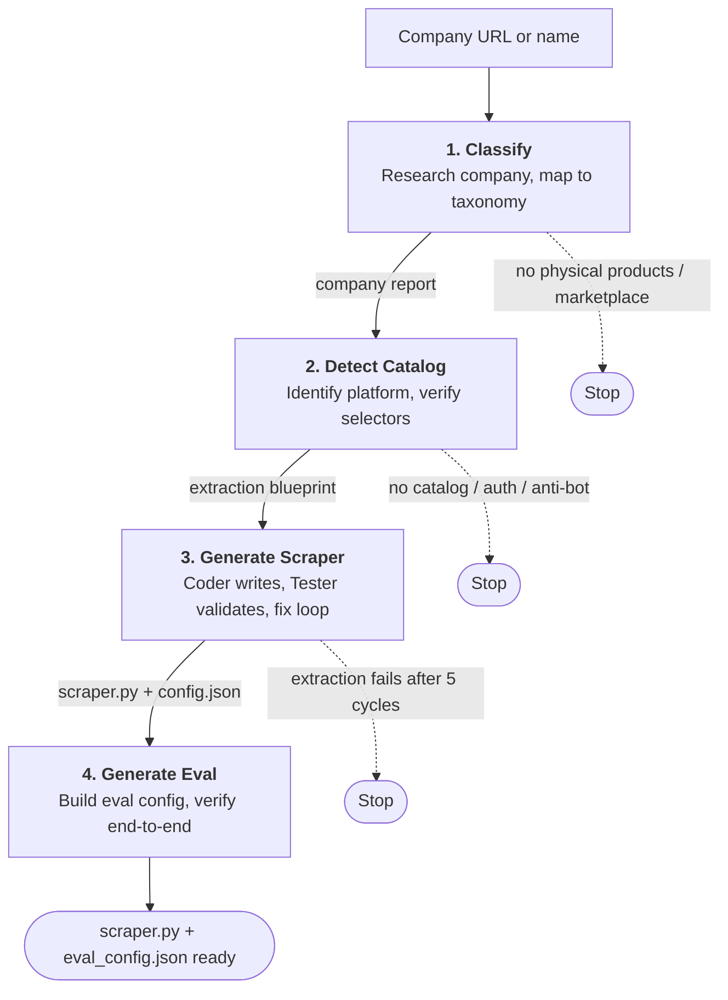
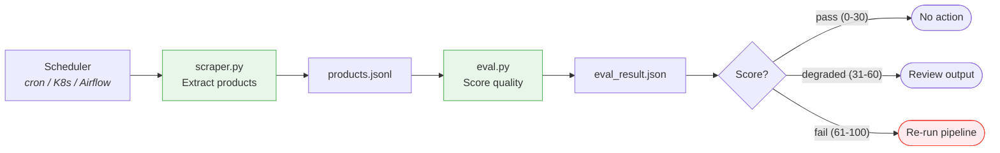
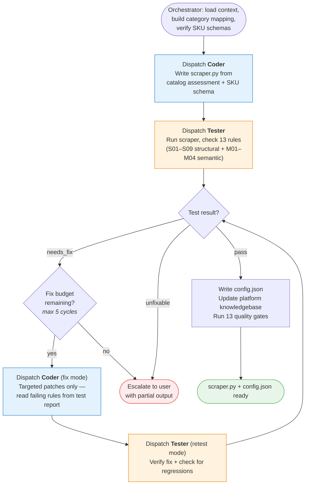

# Dark Factory

Product discovery pipeline: give it a company name or URL, get back a production-ready scraper that produces structured product data daily.

## How It Works

Two cost tiers separate expensive LLM reasoning (runs once per company) from cheap daily execution (standalone Python, no LLM).

### Generation (expensive tier — LLM, runs once)



Each stage produces a file that the next stage consumes. Any stage can **stop** when it hits a blocker, or **escalate** ambiguous decisions to the user.

| Stage | What it produces | Key decisions |
|-------|-----------------|---------------|
| **Classify** | Company report — taxonomy IDs, product lines, business model | Tangible goods gate, taxonomy mapping, ambiguous company resolution |
| **Detect Catalog** | Extraction blueprint — verified selectors, API endpoints, category tree | Platform detection, fast-path vs deep investigation, anti-bot assessment |
| **Generate Scraper** | `scraper.py` + `config.json` — standalone, tested against 13 rules | Three-agent loop ([detail below](#stage-3-scraper-generation-in-detail)): orchestrator → coder → tester, up to 5 fix cycles |
| **Generate Eval** | `eval_config.json` — 13 weighted checks tuned to this company | Attribute selection (only what the scraper actually extracts), threshold calibration |

Stage 2 uses a **platform knowledgebase** (`docs/platform-knowledgebase/`) — extraction recipes for Shopify, WooCommerce, Magento, PrestaShop, Drupal, and others. Known platforms get a fast path (load recipe, verify on 2-3 pages); unknown platforms get full site investigation. Findings are written back after every successful run.

### Daily execution (cheap tier — no LLM)



The generated `scraper.py` and `eval_config.json` run on any scheduler with zero LLM involvement. The expensive tier only re-runs when the eval detects quality degradation.

### Stage 3: Scraper generation in detail

The most complex stage uses a three-agent architecture with an automated fix-retest loop:



## Prerequisites

| Requirement | Version | Purpose |
|-------------|---------|---------|
| [Python](https://www.python.org/) | 3.10+ | Runtime for scrapers and eval |
| [uv](https://docs.astral.sh/uv/) | Latest | Runs scripts with inline dependency resolution |
| [Claude Code](https://docs.anthropic.com/en/docs/claude-code) | Latest | CLI that powers the LLM pipeline stages |
| Claude subscription | Max plan | Required for classification, catalog detection, scraper/eval generation |

Required Claude Code plugins (Playwright, Context7) are auto-installed when you open the project.

## Quick Start

### 1. Run the full pipeline

Inside Claude Code:

```
/product-discovery https://ytgloves.com
```

This runs all four stages end-to-end (see [How It Works](#how-it-works) above).

### 2. Run the generated scraper

No Claude Code needed:

```bash
# Full catalog scrape
uv run docs/scraper-generator/{slug}/scraper.py

# Smoke test (20 products)
uv run docs/scraper-generator/{slug}/scraper.py --limit 20

# Probe a single product
uv run docs/scraper-generator/{slug}/scraper.py --probe https://example.com/products/item
```

Replace `{slug}` with the company slug from the pipeline summary (e.g., `ytgloves`, `hilti`, `evolutionpowertools`). `uv run` handles dependencies automatically via PEP 723 inline metadata.

### 3. Validate scraper output

```bash
# Score existing output
uv run eval/eval.py docs/eval-generator/{slug}/eval_config.json

# Collect fresh sample and score
uv run eval/eval.py docs/eval-generator/{slug}/eval_config.json --collect
```

### 4. Interpret the results

**Scraper output** (`docs/scraper-generator/{slug}/output/`):

| File | Contents |
|------|----------|
| `products_{n}_{hash}.jsonl` | One product per line — universal fields plus category-specific attributes (see [Product record format](#product-record-format) below) |
| `summary_{n}_{hash}.json` | Run metadata: total products, duration, error count |
| `debug_{n}_{hash}.log` | Structured JSON log of every HTTP request and parse event |

Output files use `{n}_{hash}` versioning — files are never overwritten. `{n}` is the iteration number, `{hash}` is a unique 4-char hex per run.

**Eval output** (`docs/eval-generator/{slug}/output/`):

| File | Contents |
|------|----------|
| `eval_result.json` | Thirteen weighted checks, degradation score (0-100), pass/degraded/fail status |
| `eval_history.json` | Append-only log of all eval runs for trend detection |
| `baseline.json` | First-run attribute fill rates for regression detection |

| Status | Score | Action |
|--------|-------|--------|
| `pass` | 0-30 | No action needed |
| `degraded` | 31-60 | Review scraper output for issues |
| `fail` | 61-100 | Re-run the pipeline to regenerate the scraper |

When `"recommend_rediscovery": true`, the site has changed enough that a fresh pipeline run is needed.

## Eval Checks

The eval validates scraper output against thirteen weighted checks (weights sum to 100):

| Check | Weight | What it catches |
|-------|--------|-----------------|
| Core attribute coverage | 20 | Schema attributes missing — selector changes, site redesign |
| Category classification | 10 | Invalid `product_category` values |
| Pagination completeness | 10 | Broken pagination, removed categories |
| Price sanity | 10 | Parser errors, currency confusion |
| Field-level regression | 10 | Per-field fill rate drops vs previous run |
| Extended attribute coverage | 5 | Secondary attributes missing |
| Category diversity | 5 | Broken category traversal |
| Data freshness | 5 | Stale cache, broken upsert |
| Schema conformance | 5 | Type mismatches, new data formats |
| Row count trend | 5 | Sudden product count changes |
| Duplicate detection | 5 | Duplicate products by SKU |
| Extra attributes ratio | 5 | Too many unmapped attributes — schema inadequate |
| Semantic validation | 5 | Dirty values, embedded units, non-products |

Checks that can't run (no baseline yet, limited sample, no prices) are skipped and their weights redistribute proportionally.

## Product Taxonomy

The pipeline classifies every company into a canonical taxonomy of physical product subcategories. This classification drives everything downstream — which attributes to extract, how to validate quality, and how to compare products across companies.

**Scale:** 26 top-level categories, 238 subcategories, 238 SKU schemas covering industries from food to firearms.

### Taxonomy IDs

Every subcategory has a unique ID (e.g., `machinery.power_tools`, `safety.gloves_hand_protection`) defined in `docs/product-taxonomy/categories.md`. A company gets one primary ID and may have additional subcategories:

```
Subcategories: safety.gloves_hand_protection
Primary:       safety.gloves_hand_protection
```

The primary ID becomes the `product_category` field on every scraped product record.

### SKU Schemas

Each subcategory has a schema that defines which attributes to extract. Schemas are created by researching 3-5 real companies in the subcategory, then synthesizing the attributes that consistently appear on pricelists and product catalogs.

Attributes are split into two tiers:

| Tier | What goes here | Count | Fill rate target |
|------|----------------|-------|------------------|
| **Core** | Identity, material, primary dimension — what you'd compare across companies | 5-10 | >80% of products |
| **Extended** | Product-specific or rarely published — useful but not universal | 10-15 | >50% of products |

Each attribute row has a **Key** column (`snake_case` identifier) that scrapers use as the exact field name. This is the contract between schemas and scrapers — no renaming, no inference.

To create or enrich a schema manually:

```
/product-taxonomy "Safety Gloves & Hand Protection"
```

If the pipeline encounters a subcategory without a schema, it generates one automatically.

### Product record format

Every scraped product has four attribute levels plus a units map. The generated Python scraper handles all routing automatically.

| Level | What it contains | Extraction effort | Fill rate target |
|-------|-----------------|-------------------|------------------|
| **Universal top-level** | `sku`, `name`, `url`, `price`, `currency`, `brand`, `product_category`, `scraped_at`, `category_path` | Always extracted — mandatory for every product regardless of category | — |
| **`core_attributes`** | Attributes matching the SKU schema's Core table | **High** — scraper actively works to extract these (navigating tabs, parsing spec tables) | >80% of products |
| **`extended_attributes`** | Attributes matching the SKU schema's Extended table | **Moderate** — extracted when available, no complex parsing for marginal gains | >50% of products |
| **`extra_attributes`** | Everything else discovered on the page | **Low / opportunistic** — captured naturally, serves as feedback for schema evolution | — |
| **`attribute_units`** | Maps attribute keys to their unit string (e.g., `"thickness": "mm"`) | Extracted when the SKU schema specifies a unit | — |

```json
{
  "sku": "12-3365-60",
  "name": "FR Ground Glove",
  "url": "https://ytgloves.com/products/fr-ground-glove",
  "price": 65.0,
  "currency": "USD",
  "brand": "Youngstown Glove",
  "product_category": "safety.gloves_hand_protection",
  "scraped_at": "2026-03-19T21:00:00Z",
  "category_path": "Youngstown Glove > Flame Resistant",
  "core_attributes": {
    "product_type": "Heat-Resistant Glove",
    "liner_material": "Kevlar",
    "coating_material": "Double-layered goatskin"
  },
  "extended_attributes": {
    "model_number": "12-3365-60",
    "ansiisea_cut_level": "ANSI/ISEA 105 Level A4",
    "puncture_resistance": "ANSI/ISEA 105 Level 5",
    "thermal_rating": "37 cal/cm² per ASTM 2675"
  },
  "extra_attributes": {
    "flame_resistance": "exceeds standards according to ASTM F1358",
    "compliance": "NFPA 70e-2018 / OSHA 29 CFR Part 1926"
  },
  "attribute_units": {}
}
```

**`core_attributes`** and **`extended_attributes`** use keys from the SKU schema exactly. **`extra_attributes`** catches everything else — when an extra attribute appears across multiple companies, the `/product-taxonomy` skill can promote it into the schema for future scrapers.

**Non-English sites:** All attribute keys are English (matching schema Key values or `snake_case`). For universal, core, and extended values, the scraper includes static translation dicts for known value sets (species names, material types, grade labels). Extra attribute values may remain in the original language.

### Schema lifecycle

1. **Auto-generated** when the pipeline hits a subcategory without one
2. **Evolved** via the scraper-generator's feedback loop (proposes extras for promotion)
3. **Manually enriched** via `/product-taxonomy`
4. **Append-only** — attributes are never deleted, only deprecated

## Platform Knowledgebase

The catalog-detector maintains a library of platform-specific extraction patterns at `docs/platform-knowledgebase/`. Supported platforms: Shopify, WooCommerce, Magento, PrestaShop, Drupal, Neto, and custom sites.

Each knowledgebase file contains: JSON-LD patterns, CSS selectors, pagination mechanisms, common pitfalls, and a sites table tracking which companies use the platform. When the catalog-detector successfully assesses a new site, it appends findings to the relevant knowledgebase — making future assessments of the same platform faster.

## Running Individual Stages

Each stage can run independently. Upstream stages must have completed first.

| Command | What it does | Requires |
|---------|-------------|----------|
| `/product-classifier <url-or-name>` | Classify a company's products | Nothing |
| `/catalog-detector <slug>` | Assess catalog scrapability | Stage 1 |
| `/scraper-generator <slug>` | Generate a scraper | Stages 1-2 |
| `/eval-generator <slug>` | Generate quality validation | Stages 1-3 |

The slug comes from the company's domain (e.g., `ytgloves` from ytgloves.com, `hilti` from hilti.com).

## Testing

Every Python script under `.claude/skills/*/scripts/` has a corresponding test file. Run all tests:

```bash
uv run --with pytest --with httpx --with selectolax python -m pytest -v
```

Run tests for a specific skill:

```bash
uv run --with pytest --with httpx --with selectolax python -m pytest .claude/skills/catalog-detector/tests/ -v
```

Skip integration tests (no network):

```bash
uv run --with pytest --with httpx --with selectolax python -m pytest -m "not integration" -v
```

Check skill convention compliance:

```bash
uv run .claude/skills/skill-creator-local/scripts/verify_skill.py --all
```

## Project Structure

```
dark-factory/
  .claude/skills/                           # Pipeline skills (7 skills)
    product-classifier/                     #   Stage 1: company classification
    catalog-detector/                       #   Stage 2: catalog assessment
    scraper-generator/                      #   Stage 3: scraper generation (3-agent architecture)
    eval-generator/                         #   Stage 4: eval config generation
    product-discovery/                      #   Orchestrator: chains all 4 stages
    product-taxonomy/                       #   Utility: research SKU attribute schemas
    skill-creator-local/                    #   Meta: create/review pipeline skills
  eval/                                     # Shared eval script (eval.py)
  scripts/                                  # Utility scripts (schema verification, migrations)
  docs/
    product-taxonomy/                       # Canonical taxonomy + SKU schemas (tracked)
      categories.md                         #   26 categories, 238 subcategories
      sku-schemas/                          #   238 per-subcategory attribute schemas
    platform-knowledgebase/                 # Platform extraction patterns (tracked)
    product-classifier/{slug}.md            # Company reports (gitignored)
    catalog-detector/{slug}/                # Catalog assessments (gitignored)
    scraper-generator/{slug}/               # Scraper artifacts (gitignored)
      scraper.py                            #   Standalone scraper
      config.json                           #   Category mapping + metadata
      output/                               #   products_{n}_{hash}.jsonl + summary + debug log
    eval-generator/{slug}/                  # Eval artifacts (gitignored)
      eval_config.json                      #   13 weighted checks
      output/                               #   eval_result.json + history + baseline
```

Per-company output is gitignored — regenerate by re-running the pipeline.
